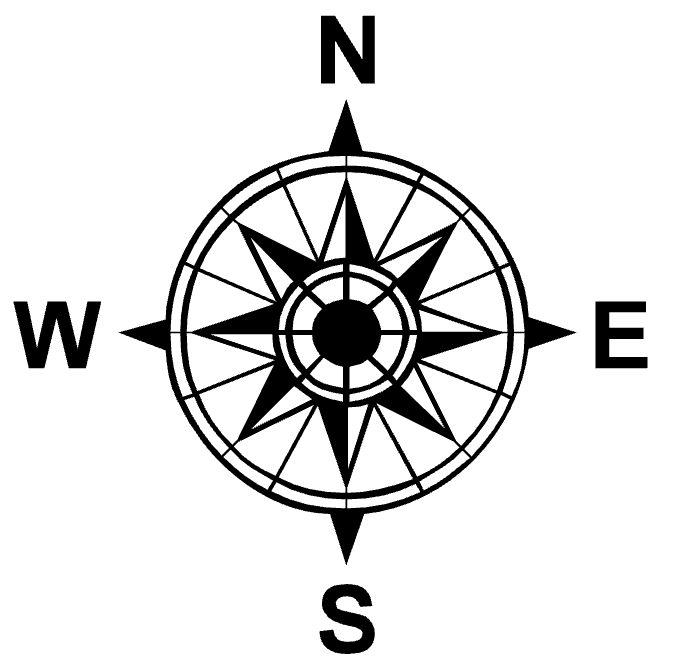
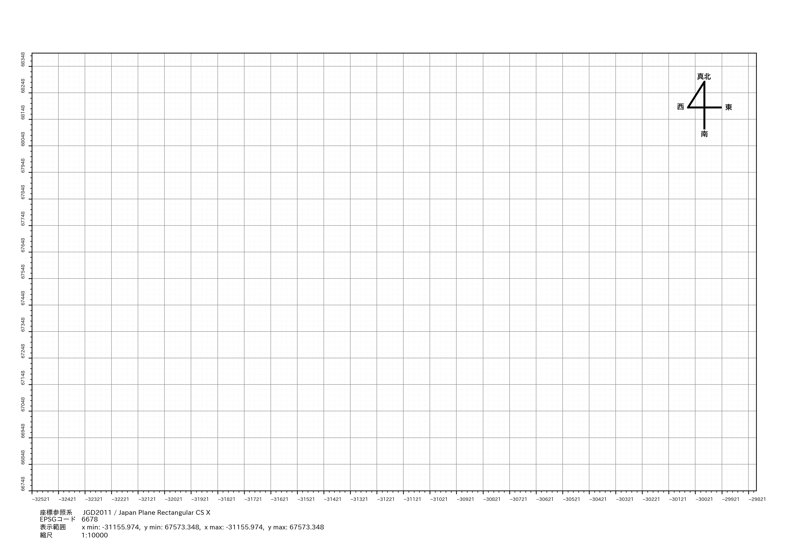
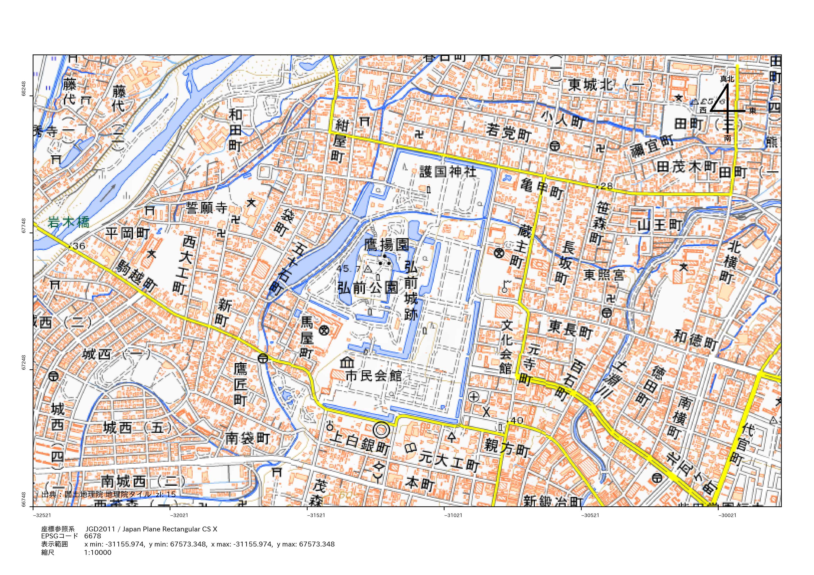
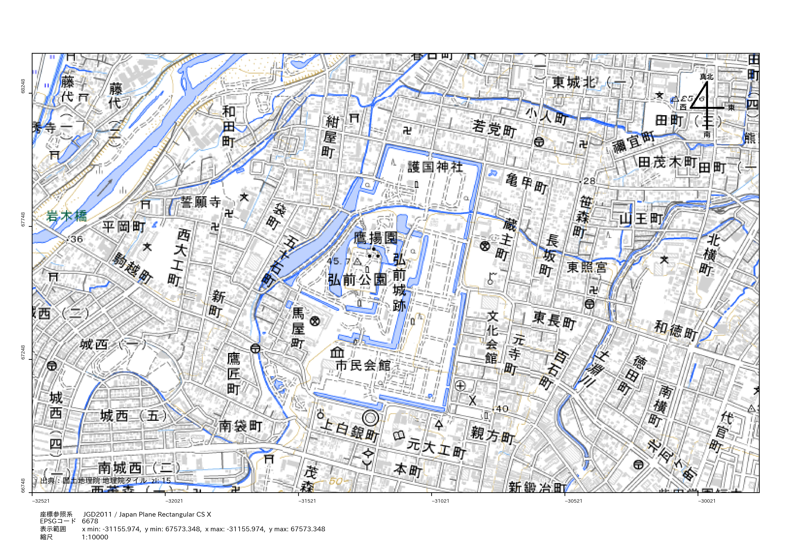
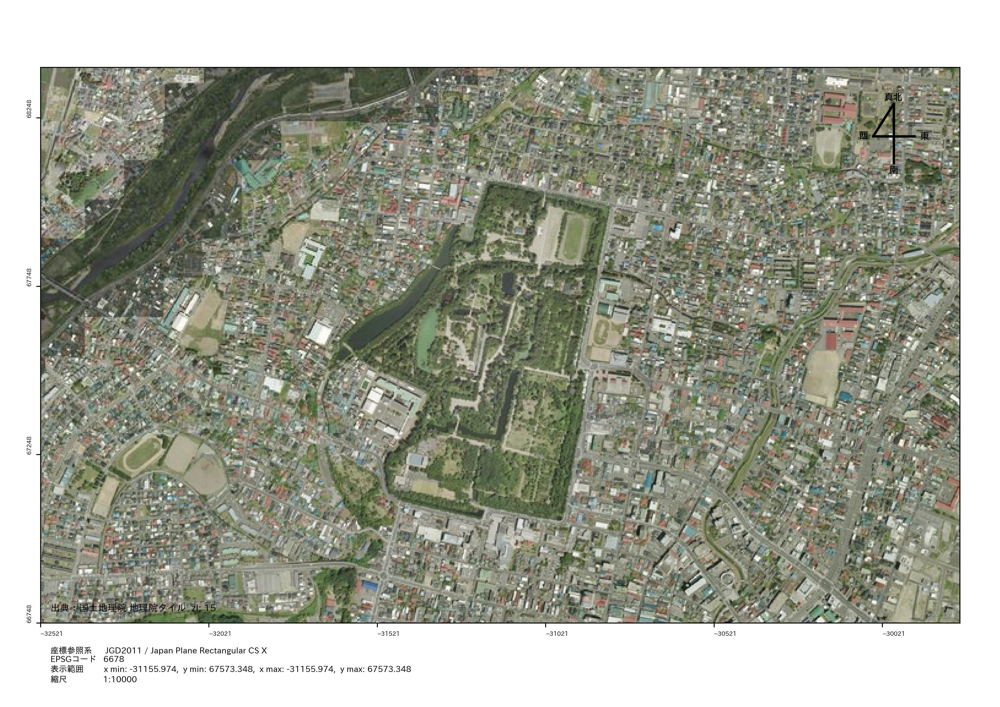
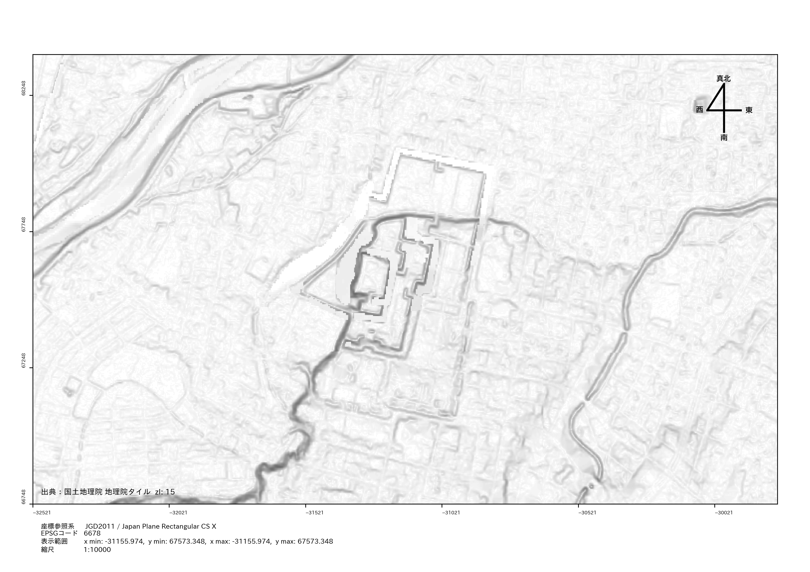

# Chiriin
国土地理院のAPIやパラメーターファイルを利用するモジュール。


## **1. 計算の準備**
```python
# モジュールのインポート
from drawer import chiriin_drawer
```

### **1-1. 地磁気値（偏角）の取得**
---
国土地理院国土地理院の公開している地磁気値（2020.0年値）のパラメーターファイルを用いて、任意の地点の地磁気偏角を計算します。

地磁気値のパラメーターは、標準メッシュコードに紐づいているので、経緯度からメッシュコードを計算し、その地点の地磁気値を取得します。

この地磁気値はAPIがなく、パラメーターファイルが5年ごとに更新されるので、最新の値を使用する必要があります。

参考: [磁器図](https://www.gsi.go.jp/buturisokuchi/menu03_magnetic_chart.html)

```python
>>> lon = 140.728595
>>> lat = 40.832583
>>> mag_delta = chiriin_drawer.magnetic_declination(lon, lat)
>>> print(f"type: {type(mag_delta)}, value: {mag_delta}")
type: <class 'float'>, value: 8.67
```

### **1-2. メッシュコードの取得**
---
任意の地点のメッシュコードを取得します。経緯度が度分秒形式の場合は、10進法に変換してから計算します。地域メッシュコードの計算方法は、総務省が公開しているPDFファイルを参考にしています。

`.get_mesh_code`メソッドの戻り値は`MeshCode`クラスであり、クラスの中には各メッシュコードが文字列型で記録されています。

 - 第1次メッシュコード [first_mesh_code]
 - 第2次メッシュコード [secandary_mesh_code]
 - 基準地域メッシュコード [standard_mesh_code]
 -  2分の1地域メッシュコード [half_mesh_code]
 - 4分の1地域メッシュコード [quarter_mesh_code]

参考: [地域メッシュ統計の特質・沿革](https://www.stat.go.jp/data/mesh/pdf/gaiyo1.pdf)

```python
>>> lon = 140.728595
>>> lat = 40.832583 
>>> mesh_code = chiriin_drawer.get_mesh_code(lon, lat)
>>> print(f"type: {type(mesh_code)}")
type: <class 'chiriin.mesh.MeshCode'>
>>> print(mesh_code)
First Mesh Code: 6140
Second Mesh Code: 614015
Standard Mesh Code: 61401598
Half Mesh Code: 614015983
Quarter Mesh Code: 6140159832
```

### **1-3. セミダイナミック補正（2次元）**
---
セミダイナミック補正による2次元の地殻変動補正を行い、補正後の座標を返すメソッドです。補正には「今期から元期へ」と「元期から今期へ」の変換があり、それぞれパラメーターファイルを取得する為に座標の計測日が必要です。

テストで殆ど誤差がない事は確認していますが、海沿いはパラメーターファイルが無く確実ではないので、遅くともWebAPIを使用したメソッドを利用する方がおすすめです。


```python
>>> lon = 140.7285951023
>>> lat = 40.8325830233
>>> corrected_xy = chiriin_drawer.semidynamic_2d(
...     lon=lon,
...     lat=lat,
...     datetime_="2023-10-01 00:00:00",
...     # Trueならば今期から元期へ、Falseならば元期から今期へ
...     return_to_original = True
... )
>>> print(type(corrected_xy))
type: <class 'chiriin.config.XY'>
>>> print(corrected_xy)
XY(x=140.7285899124, y=40.832587534)
```

### **1-4. WebAPIを利用したセミダイナミック補正（2次元）**
---
セミダイナミック補正による2次元の地殻変動補正を行い、補正後の座標を返すメソッドです。補正には「今期から元期へ」と「元期から今期へ」の変換があり、それぞれパラメーターファイルを取得する為に座標の計測日が必要です。

通常のセミダイナミック補正メソッド（`semidynamic_2d`）とは異なり、このメソッドは国土地理院の公開しているWeb APIを使用して、セミダイナミック補正を行います。その為、API利用制限があり10秒間に10回のリクエストに制限しています。

```python
>>> lon = 140.7285951023
>>> lat = 40.8325830233
>>> corrected_xy = chiriin_drawer.fetch_semidynamic_2d(
...     lon=lon,
...     lat=lat,
...     datetime_="2023-10-01 00:00:00",
...     # Trueならば今期から元期へ、Falseならば元期から今期へ
...     return_to_original = True
... )
>>> print(type(corrected_xy))
type: <class 'chiriin.config.XY'>
>>> print(corrected_xy)
XY(x=140.728590117, y=40.8325875)
```


### **1-5. WebAPIを利用したセミダイナミック補正（3次元）**
---
セミダイナミック補正による3次元の地殻変動補正を行い、補正後の座標を返すメソッドです。補正には「今期から元期へ」と「元期から今期へ」の変換があり、それぞれパラメーターファイルを取得する為に座標の計測日が必要です。

通常のセミダイナミック補正メソッド（`semidynamic_3d`）とは異なり、このメソッドは国土地理院の公開しているWeb APIを使用して、セミダイナミック補正を行います。その為、API利用制限があり10秒間に10回のリクエストに制限しています。

```python
>>> lon = 140.7285951023
>>> lat = 40.8325830233
>>> alti = 1.2
>>> corrected_xy = chiriin_drawer.fetch_semidynamic_2d(
...     lon=lon,
...     lat=lat,
...     altitude=alti,
...     datetime_="2023-10-01 00:00:00",
...     # Trueならば今期から元期へ、Falseならば元期から今期へ
...     return_to_original = True
... )
>>> print(type(corrected_xy))
type: <class 'chiriin.config.XY'>
>>> print(corrected_xy)
XYZ(x=140.728590117, y=40.8325875, z=1.14)
```

### **1-6. 2点間の距離と方位角を求める**
---
2点間の距離と方位角を計算するメソッドです。国土地理院の公開しているWeb APIを使用して、距離と方位角を計算します。このメソッドには、10秒間に10回のリクエスト制限があります。現状では高低角や斜距離は0で出力されます。

```python
>>> resps = chiriin_drawer.fetch_distance_and_azimuth(
...     lon1=140.7285951023,
...     lat1=40.8325830233,
...     lon2=140.7245901023,
...     lat2=40.8325830233,
... )
>>> print(type(resps))
type: <class 'chiriin.config.RelativePosition'>
>>> print(resps)
RelativePosition(
    xyz1=XY(x=140.7285951023, y=40.8325830233), 
    xyz2=XY(x=140.7245901023, y=40.8325830233), 
    azimuth=270.001308333333, 
    level_distance=337.772, 
    angle=0.0, 
    slope_distance=0.0
)
```


### **1-7. 標高値を取得**
---
国土地理院の公開しているWeb APIを使用して、標高を取得します。このメソッドは、10秒間に10回のリクエスト制限があります。
```python
>>> elev = chiriin_drawer.fetch_elevation(lon, lat, in_crs="EPSG:4326")
>>> print(f"type: {type(res)}, value: {res}")
type: <class 'float'>, value: 1.4
```


### **1-8. 標高タイルの取得**
---
指定した座標とズームレベルに対応する標高タイルの情報を取得します。
現在取得できる標高タイルは以下の3つです。

 - DEM5A ... レーザー測量データ（5mメッシュ）
 - DEM5B ... 写真測量データ（5mメッシュ）
 - DEM10B ... （10mメッシュ）


関数の戻り値は単純な配列ではなく、`TileData` または `list[TileData]`を返します。`TileData`には様々な情報が記録されており、RasterDataを作成する際にも使用できます。

```python
# TileData class
class TileData:
    zoom_level: int  # 指定したズームレベル
    x_idx: int  # X方向のタイルインデックス
    y_idx: int  # Y方向のタイルインデックス
    tile_scope: TileScope  # タイルの投影範囲
    x_resolution: float  # X方向地上分解能
    y_resolution: float  # Y方向地上分解能
    crs: pyproj.CRS  # CRS(EPSG:3857)
    ary: np.ndarray  # 標高タイルの配列
    width: int = 256  # X方向のセル数
    height: int = 256  # Y方向のセル数
```

#### 1-8-1. XY座標から標高タイルを取得する
```python
>>> lon = 140.7285951023
>>> lat = 40.8325830233
>>> res = chiriin_drawer.fetch_elevation_tile_xy(
...     x=lon, 
...     y=lat, 
...     zoom_level=15, 
...     in_crs="EPSG:4326", 
...     elev_type="dem5a"
... )
>>> print(f"type: {type(res)}")
type: <class 'chiriin.config.TileData'>
```

#### 1-8-2. `shapely.geoemtry`から標高タイルを取得する
```python
>>> lon = 140.7285951023
>>> lat = 40.8325830233
>>> geom = shapely.Point([lon, lat]).buffer(0.0001).envelope
>>> res = chiriin_drawer.fetch_elevation_tile_geometry(
...     geometry=geom,
...     zoom_level=15, 
...     in_crs="EPSG:4326", 
...     elev_type="dem5a"
... )
>>> print(f"type: {type(res)}")
type: <class 'list'>
>>> print(f"type: {type(res[0])}")
type: <class 'chiriin.config.TileData'>
```

#### 1-8-3. DEM10Bの標高タイルを取得する
DEM10Bのズームレベルは 1~14で指定してください。

```python
>>> lon = 140.7285951023
>>> lat = 40.8325830233
>>> geom = shapely.Point([lon, lat]).buffer(0.0001).envelope
>>> res = chiriin_drawer.fetch_elevation_tile_mesh_with_dem10b(
...     geometry=geom,
...     zoom_level=14, 
...     in_crs="EPSG:4326",
... )
>>> print(f"type: {type(res)}")
type: <class 'list'>
>>> print(f"type: {type(res[0])}")
type: <class 'chiriin.config.TileData'>
```

#### 1-8-4. DEM10Aの標高タイルを取得する
DEM10Bのズームレベルは 1~15で指定してください。

```python
>>> lon = 140.7285951023
>>> lat = 40.8325830233
>>> geom = shapely.Point([lon, lat]).buffer(0.0001).envelope
>>> res = chiriin_drawer.fetch_elevation_tile_mesh_with_dem5a(
...     geometry=geom,
...     zoom_level=15, 
...     in_crs="EPSG:4326",
... )
>>> print(f"type: {type(res)}")
type: <class 'list'>
>>> print(f"type: {type(res[0])}")
type: <class 'chiriin.config.TileData'>
```

### **1-9. 画像タイルの取得**
---
指定した座標とズームレベルに対応する画像タイルの情報を取得します。
現在設定されている画像は以下のとおりです。

 - 標準地図 [standard]
 - 淡色地図 [pale]
 - 航空写真 [photo]
 - 傾斜図 [slope]

##3# 1-9-1. XY座標から画像タイルを取得する
```python
>>> lon = 140.7285951023
>>> lat = 40.8325830233
>>> res = chiriin_drawer.fetch_img_tile_xy(
...     x=lon, 
...     y=lat, 
...     zoom_level=15, 
...     in_crs="EPSG:4326", 
...     image_type="standard"
... )
>>> print(f"type: {type(res)}")
type: <class 'chiriin.config.TileData'>
```

#### 1-9-2. 標準地図のタイルを取得する
標準地図のタイルはズームレベルを 5 ~ 18 で指定します。
```python
>>> lon = 140.7285951023
>>> lat = 40.8325830233
>>> geom = shapely.Point([lon, lat]).buffer(0.0001).envelope
>>> chiriin_drawer.fetch_img_tile_geometry_with_standard_map(
...     geometry=geom,
...     zoom_level=15,
...     in_crs="EPSG:4326",
... )
>>> print(f"type: {type(res)}")
type: <class 'list'>
>>> print(f"type: {type(res[0])}")
type: <class 'chiriin.config.TileData'>
```

#### 1-9-3. 淡色地図のタイルを取得する
淡色地図のタイルはズームレベルを 5 ~ 18 で指定します。
```python
>>> lon = 140.7285951023
>>> lat = 40.8325830233
>>> geom = shapely.Point([lon, lat]).buffer(0.0001).envelope
>>> chiriin_drawer.fetch_img_tile_geometry_with_pale_map(
...     geometry=geom,
...     zoom_level=18,
...     in_crs="EPSG:4326",
... )
>>> print(f"type: {type(res)}")
type: <class 'list'>
>>> print(f"type: {type(res[0])}")
type: <class 'chiriin.config.TileData'>
```

#### 1-9-4. 航空写真のタイルを取得する
淡色地図のタイルはズームレベルを 2 ~ 18 で指定します。
```python
>>> lon = 140.7285951023
>>> lat = 40.8325830233
>>> geom = shapely.Point([lon, lat]).buffer(0.0001).envelope
>>> chiriin_drawer.fetch_img_tile_geometry_with_photo_map(
...     geometry=geom,
...     zoom_level=18,
...     in_crs="EPSG:4326",
... )
>>> print(f"type: {type(res)}")
type: <class 'list'>
>>> print(f"type: {type(res[0])}")
type: <class 'chiriin.config.TileData'>
```


#### 1-9-5. 傾斜図のタイルを取得する
傾斜図のタイルはズームレベルを 3 ~ 15 で指定します。
```python
>>> lon = 140.7285951023
>>> lat = 40.8325830233
>>> geom = shapely.Point([lon, lat]).buffer(0.0001).envelope
>>> chiriin_drawer.fetch_img_tile_geometry_with_photo_map(
...     geometry=geom,
...     zoom_level=15,
...     in_crs="EPSG:4326",
... )
>>> print(f"type: {type(res)}")
type: <class 'list'>
>>> print(f"type: {type(res[0])}")
type: <class 'chiriin.config.TileData'>
```

### **1-9. ジオイド高の取得**
---
国土地理院の公開しているWeb APIを使用して、ジオイド高を取得します。このメソッドには、10秒間に10回のリクエスト制限があります。

```python
>>> lon = 140.7285951023
>>> lat = 40.8325830233
>>> res = chiriin_drawer.fetch_geoid_height(x=lon, y=lat, in_crs="EPSG:4326", year=2011)
>>> print(f"type: {type(res)}, value: {res}")
type: <class 'float'>, value: 37.0289
>>> res = chiriin_drawer.fetch_geoid_height(x=lon, y=lat, in_crs="EPSG:4326", year=2024)
>>> print(f"type: {type(res)}, value: {res}")
type: <class 'float'>, value: 37.2381
```

## **2. 作図**
地理院から取得したタイルの情報などを利用し、作図の準備を行います。しかし、以下で紹介する`MapEditor`クラスには、`geometry`の描画機能は含まれておりません。

`MapEditor`クラスの目的は、図面をPDFとして出力する事であり、その為に「表示範囲」、「縮尺」、「ベースマップ」、「グリッド」「アイコン追加（方位記号など）」等の設定を行う為のものです。

実際に`geometry`を描画するには、`matplotlib`や`shapely.plotting`、`geopandas`などのライブラリを使用して、`MapEditor`クラスのインスタンス化後に描画を行う必要があります。


### **2-1-1. MapEditorクラスのインスタンス化**
---
`MapEditor`クラスはインスタンス化する際に、以下の引数を指定します。

正しい縮尺を表示する為に、図面の座標系の距離単位は"メートル単位"である必要があります。`out_crs`に引数指定しない場合は、UTM座標系が推定されます。

```python
>>> from drawer import MapEditor

>>> map_editor = MapEditor(
...     geometry=shapely.Point(140.728595, 40.832583),  # 描画したいジオメトリ
...     in_crs="EPSG:4326",  # 入力座標系
...     out_crs="EPSG:6678",  # 出力座標系
...     paper_size="landscape_a4",  # 用紙サイズ
...     describe_crs=True,  # CRSの説明を表示するかどうか
...     # **kwargs:  # その他のオプション
...     left_cm=1.2,  # 左の余白（cm単位）
...     right_cm=1.2,  # 右の余白（cm単位）
...     top_cm=2.0,  # 上の余白（cm単位）
...     bottom_cm=2.5,  # 下の余白（cm単位）
... )
```
### **2-1-2. MapEditorクラスのインスタンス変数**
**fig(plt.Figure):** `matplotlib`の`Figure`オブジェクト。

**ax(plt.Axes):** `matplotlib`の`Axes`オブジェクト。

**fig_size(FigureSize):** 使用する紙のサイズをインチ単位で表すタプル。

**map_width(float):** 地図の幅（センチメートル単位）。この中には余白は含まれません。

**map_height(float):** 地図の高さ（センチメートル単位）。この中には余白は含まれません。

**out_crs(pyproj.CRS):** 投影する座標参照系（CRS）。座標の単位はメートルでなければなりません。

**org_geometry(BaseGeometry | list[BaseGeometry]):** 元のジオメトリー

**metre_geometry(BaseGeometry | list[BaseGeometry]):** メートル単位に変換されたジオメトリー。

**geom_scope(Scope):** ジオメトリーの範囲を表す`Scope`オブジェクト。

**valid_scales(dict[int, Scope]):** 投影可能な縮尺とその範囲を表す辞書。キーは縮尺（整数型）で、値は`Scope`オブジェクトです。`Scope`オブジェクトは余白を含まない地図の表示範囲を表します。


### **2-2. 縮尺の設定**
---
図面を正しい縮尺で表示する為に、`MapEditor`クラスをインスタンス化した際に、引数として渡した`geometry`の範囲を計算し、設定した用紙サイズに投影可能な縮尺を"Dictionary"型で`valid_scales`に保持しています。

`valid_scales`は、整数型の縮尺をキーに、`TileScope`オブジェクトを値とする辞書です。`TileScope`オブジェクトは、X軸とY軸の最小値と最大値を持ち、図面の表示範囲を定義するのに使用されます。

```python
>>> map_scope = map_eiditor.valid_scales.get(10_000, False)
>>> if scale:
>>>     map_editor.set_lims(
...         # *map_scopeで省略可能
...         x_min=map_scope.x_min,  # X軸の最小値
...         y_min=map_scope.y_min,  # Y軸の最小値
...         x_max=map_scope.x_max,  # X軸の最大値
...         y_max=map_scope.y_max,  # Y軸の最大値
...         major_tick=100,  # メジャー目盛りの間隔
...         major_grid=True,  # メジャーグリッドを表示するかどうか
...         minor_grid=False,  # マイナーグリッドを表示するかどうか
...     )
>>> else:
>>>     print("指定した縮尺は無効です。")
```

### **2-3. 方位記号の追加**
---
`MapEditor`クラスには、方位記号を追加するメソッドが用意されています。方位記号は、地図上に北を示すためのアイコンです。

```python
>>> map_editor.add_icon_of_true_north(img_size=2.5)
>>> map_editor.add_icon_of_simple_compass(img_size=2.5)
>>> map_editor.add_icon_of_compass(img_size=2.5)
```





### **2-4. 縮尺ラベルの追加**
---
`MapEditor`クラスには、縮尺ラベルを追加するメソッドが用意されています。縮尺ラベルは、地図上に現在の縮尺を示すためのテキストです。

```python
>>> map_editor.add_scale_txt(10_000)
```


### **2-5. ベースマップの追加**
---
`MapEditor`クラスには、ベースマップを追加するメソッドが用意されています。ベースマップは、地図の背景として使用される画像で、国土地理院の地理院タイルを利用して表示します。

現在は以下のベースマップが利用可能です。

 - 標準地図 [standard] Zoom Level: 5 ~ 18
 - 淡色地図 [pale] Zoom Level: 5 ~ 18
 - 航空写真 [photo] Zoom Level: 2 ~ 18
 - 傾斜図 [slope] Zoom Level: 3 ~ 15

```python
>>> map_editor.add_basemap(
...     # *map_scopeで省略可能
...     x_min=map_scope.x_min,  # X軸の最小値
...     y_min=map_scope.y_min,  # Y軸の最小値
...     x_max=map_scope.x_max,  # X軸の最大値
...     y_max=map_scope.y_max,  # Y軸の最大値
...     map_name="standard",  # ベースマップの種類（standard, pale, photo, slope）
...     zl=15,  # ズームレベル
... )
```

### **2-6. グリッドの削除**
---
`MapEditor`クラスには、グリッドを削除するメソッドが用意されています。グリッドは、地図上に目盛りを表示するための線ですが、必要ない場合は削除することができます。

```python
>>> map_editor.remove_axis_grid()
```


### **2-7. 範囲の設定**
---
すべての描画が完了したら、`MapEditor`クラスの`set_scope`メソッドを使用して、図面の表示範囲を設定します。このメソッドは一番最後に呼び出す必要があります。このメソッドを呼び出さない場合、図面の縮尺は正しく表示されません。

```python
>>> map_editor.set_scope(
...     # *map_scopeで省略可能
...     x_min=map_scope.x_min,  # X軸の最小値
...     y_min=map_scope.y_min,  # Y軸の最小値
...     x_max=map_scope.x_max,  # X軸の最大値
...     y_max=map_scope.y_max,  # Y軸の最大値
... )
```

### **2-8. 使用例**
---
以下に、`MapEditor`クラスを使用して地図を作成する例を示します。この例では、グリッド、ベースマップ、方位記号、縮尺ラベルを追加し、最終的にPDFとして出力します。

```python
from matplotlib import pyplot as plt

from drawer import MapEditor

>>> _points = [
    'POINT (140.4646559837494 40.61244684442613)',
    'POINT (140.46903949942302 40.611764534075995)',
    'POINT (140.46801290517573 40.6076019927892)',
    'POINT (140.468413301053 40.607491863579405)',
    'POINT (140.46748706507026 40.603271885288194)',
    'POINT (140.46487253321905 40.603596327499865)',
    'POINT (140.46469295915807 40.603273240550536)',
    'POINT (140.46177546360383 40.60372462598491)',
    'POINT (140.46126285127215 40.604112040547896)',
    'POINT (140.46110456608216 40.604797511888364)',
    'POINT (140.46262506479448 40.60677332023964)',
    'POINT (140.4599798596257 40.60775281754854)',
]
>>> points = [shapely.from_wkt(p) for p in _points]
>>> map_editor = MapEditor(
...     geometry=points,
...     in_crs="EPSG:4326",
...     out_crs="EPSG:6678",
...     paper_size="landscape_a4",
...     describe_crs=True,
... )
>>> # 縮尺の設定
>>> scale = 10_000
>>> map_scope = map_editor.valid_scales.get(scale, False)
>>> if map_scope:
...     map_editor.set_lims(
...         *map_scope,
...         major_tick=500,
...         major_grid=False,
...         minor_grid=False,
...     )
>>> else:
...     print("指定した縮尺は無効です。")
>>> # Pointの描画
>>> for i, p in enumerate(map_editor.metre_geometry):
...     map_editor.ax.scatter(p.x, p.y, marker="o", color="red", s=10, label="Point")
...     map_editor.ax.text(p.x + 0.0001, p.y + 0.0001, f"P-{i}", fontsize=8, color="red")
>>> # 方位記号の追加
>>> map_editor.add_icon_of_simple_compass(img_size=2.5)
>>> # 縮尺ラベルの追加
>>> map_editor.add_scale_txt(scale)
>>> # ベースマップの追加
>>> map_editor.add_basemap(*map_scope, map_name="pale", zl=18)
>>> # 範囲の設定
>>> map_editor.set_scope(*map_scope)
>>> # PDFとしmap_editor.add_basemap(て保存
>>> plt.save_pdf("output_map.pdf", dpi=300, format="pdf")
```


#### 例1）グリッドのみ



#### 例2）標準地図（[出典：国土地理院　地理院タイル](https://maps.gsi.go.jp/development/ichiran.html)）



#### 例3）淡色地図（[出典：国土地理院　地理院タイル](https://maps.gsi.go.jp/development/ichiran.html)）



#### 例4）航空写真（[出典：国土地理院　地理院タイル](https://maps.gsi.go.jp/development/ichiran.html)）



#### 例5）傾斜図（[出典：国土地理院　地理院タイル](https://maps.gsi.go.jp/development/ichiran.html)）



